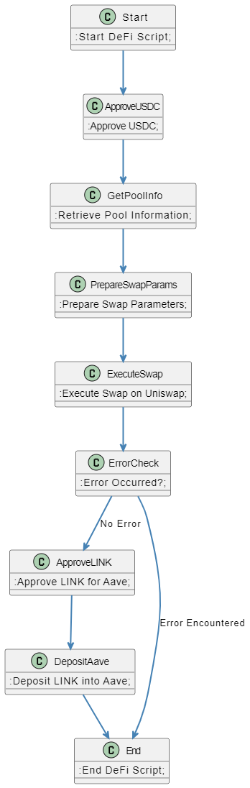

# DeFi Automation Script

## Overview of Script

This script is designed to automate a series of decentralized finance (DeFi) operations, interacting with multiple DeFi protocols to streamline complex financial transactions. The script performs the following operations:

1. **Approval of USDC**: The script starts by approving a specified amount of USDC (USD Coin) to be used in further transactions.
   
2. **Retrieval of Pool Information**: After approval, the script retrieves relevant information from a liquidity pool. This includes data such as token pairs, liquidity depth, and other metrics crucial for executing a swap.
   
3. **Preparation of Swap Parameters**: Once the pool information is obtained, the script prepares the necessary parameters for executing a swap on a decentralized exchange (DEX) like Uniswap. This includes setting the token amounts, specifying slippage tolerance, and choosing the appropriate route for the swap.

4. **Execution of Swap on Uniswap**: With the parameters prepared, the script proceeds to execute the swap on Uniswap, exchanging the approved USDC for LINK (Chainlink) or another specified token.
   
5. **Approval of LINK for Aave**: After the swap, the script approves the LINK tokens to be used in the Aave protocol, which is a decentralized lending and borrowing platform.
   
6. **Deposit of LINK into Aave**: Finally, the script deposits the LINK tokens into Aave to earn interest or for collateralization purposes.

7. **Error Handling**: The script includes error-checking mechanisms to handle any potential issues during execution, such as insufficient funds, transaction failures, or slippage beyond the allowed tolerance.

8. **End of Script**: Upon successful completion of all operations, the script ends, ensuring that all interactions are finalized, and resources are properly allocated.

## Diagram Illustration

The following diagram illustrates the sequence of steps and interactions between the DeFi protocols:



This flowchart visually represents the process, showing how the script moves from one operation to the next, ensuring a smooth and efficient DeFi transaction flow.


# Code Explanation

## Overview

This document provides a detailed explanation of the code used in the DeFi Automation Script. It highlights the key functions, the logic behind them, and how interactions with various DeFi protocols are managed.

## Key Functions and Logic

### 1. **USDC Approval**

```python
def approve_usdc(amount):
    # Function to approve USDC for further transactions
    usdc_contract.approve(spender, amount)


- **Purpose**: This function is responsible for approving a specified amount of USDC to be used in subsequent DeFi operations.
- **Logic**: The function calls the `approve` method of the USDC contract, allowing a designated `spender` to spend the specified `amount` of USDC on behalf of the user.

### 2. **Retrieve Pool Information**

```python
def get_pool_info():
    # Function to retrieve liquidity pool information
    pool_info = dex_contract.get_pool_info(token_pair)
    return pool_info
```

- **Purpose**: Retrieves essential information from the liquidity pool that will be used for executing the token swap.
- **Logic**: The function interacts with the DEX (Decentralized Exchange) contract to obtain data like token pairs, liquidity levels, and other metrics necessary for performing a swap.

### 3. **Prepare Swap Parameters**

```python
def prepare_swap_params(amount_in, amount_out_min, slippage):
    # Function to prepare parameters for the swap
    params = {
        'amount_in': amount_in,
        'amount_out_min': amount_out_min,
        'slippage': slippage,
    }
    return params
```

- **Purpose**: Prepares the parameters required to perform a swap on a DEX.
- **Logic**: This function sets up the input amount (`amount_in`), the minimum output amount (`amount_out_min`), and the acceptable slippage. These parameters ensure that the swap is executed under the desired conditions.

### 4. **Execute Swap on Uniswap**

```python
def execute_swap(params):
    # Function to execute a swap on Uniswap
    tx_receipt = uniswap_contract.swap(params)
    return tx_receipt
```

- **Purpose**: Executes the token swap on Uniswap, exchanging one token for another.
- **Logic**: This function calls the `swap` method on the Uniswap contract using the prepared parameters. It returns a transaction receipt that contains details of the executed swap.

### 5. **Approve LINK for Aave**

```python
def approve_link(amount):
    # Function to approve LINK tokens for use in Aave
    link_contract.approve(aave_contract_address, amount)
```

- **Purpose**: Approves LINK tokens for use in the Aave protocol.
- **Logic**: Similar to the USDC approval, this function allows the Aave contract to spend a specified amount of LINK tokens, enabling their deposit into the protocol.

### 6. **Deposit LINK into Aave**

```python
def deposit_link(amount):
    # Function to deposit LINK into Aave
    tx_receipt = aave_contract.deposit(link_token_address, amount)
    return tx_receipt
```

- **Purpose**: Deposits the approved LINK tokens into Aave to earn interest or for collateralization.
- **Logic**: The function interacts with the Aave contract to deposit the specified amount of LINK, securing the transaction with a returned receipt.

### 7. **Error Handling**

```python
def check_for_errors(tx_receipt):
    # Function to check for errors in the transaction
    if not tx_receipt.success:
        raise Exception("Transaction failed with error: {}".format(tx_receipt.error_message))
```

- **Purpose**: Ensures that each transaction is successfully executed and handles any errors that may arise.
- **Logic**: The function examines the transaction receipt to check for any issues. If an error is detected, it raises an exception with a detailed error message.

### 8. **End of Script**

```python
def end_script():
    # Function to end the script
    print("DeFi Automation Script completed successfully.")
```

- **Purpose**: Concludes the script after all operations have been completed.
- **Logic**: The function provides a final confirmation that the script has run successfully, signaling the end of the process.

## Interactions with DeFi Protocols

- **Uniswap**: The script interacts with Uniswap to execute token swaps. It prepares the necessary parameters and calls the `swap` function to perform the exchange.

- **Aave**: After obtaining LINK tokens through the swap, the script interacts with Aave to approve and deposit the tokens, enabling them to earn interest or be used as collateral.

- **Error Handling**: Each interaction with the DeFi protocols includes robust error handling to ensure the script runs smoothly and can recover from any issues.

---

This code explanation should give you a comprehensive understanding of the script's structure and logic, as well as how it interacts with the various DeFi protocols to automate complex financial operations.
```

